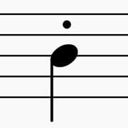

# Staccato-Discord

The music bot for your discord server
## Requirements
* Node - Version 12 or later
* npm - this comes with node
* A google cloud project with the youtube api enabled and an api key
* A discord application with the bot enabled and it's api key
## How to setup
### Clone the repository
```bash
git clone https://github.com/TheBlueOompaLoompa/Staccato-Discord.git
```
### cd into the directory
```bash
cd Staccato-Discord
```
### Install the dependencies
```bash
npm i
```
### Create the file to startup with configurations (this will only work on linux)
Create a file in the root Staccato-Discord called .env
Inside that file put
```
BOT_TOKEN=YOUR DISCORD BOT TOKEN HERE
YOUTUBE_API_KEY=YOUR GCP YOUTUBE DATA API KEY HERE
BOT_PREFIX=WHATEVER YOU WANT TO BE USED BEFORE THE COMMANDS
```
You don't need to add the bot prefix line because by default the prefix is ```.```
# Starting the bot
Just run npm start